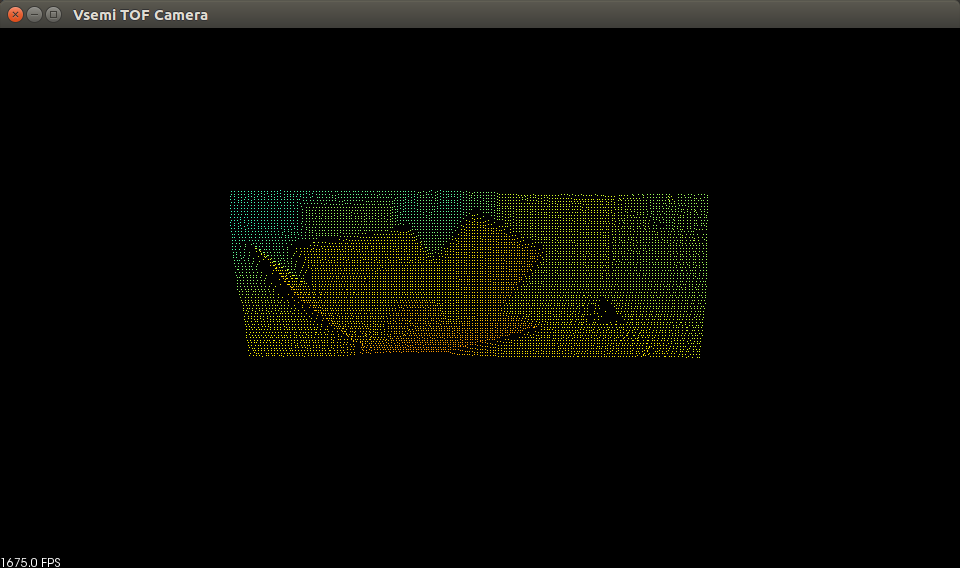
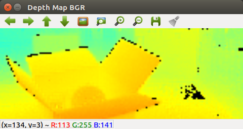
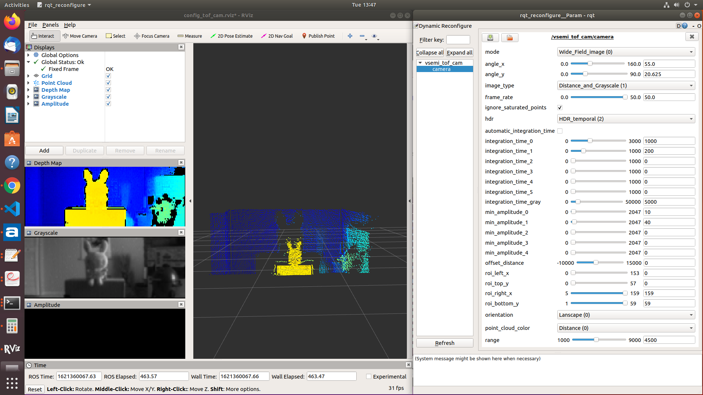

## VSEMI TOF SDK 2.0.1
Visionary Semiconductor Inc.
Jun 21, 2021

## Introduction

   **VSEMI ToF SDK 2.0** is a lightweight development kit for VSemi ToF camera, with no external dependency.

   Built with the Time-of-Flight (**ToF**) depth vision technology, VSemi ToF camera was designed for reliable depth sensing with high accuracy. 
   It was developed for easy and fast development and/or deployment in real applications, such as robotics, drones, and automotives. 
   As a ToF 3D camera, **VSemi ToF camera** does not have moving components and is thus robust and wear-free. 

## Quick start:

**Before start**
 - **Plug** your Vsemi ToF 3D sensor;
 - Grant **USB permission** to the current user (refer to the instruction of sample applications), and *remember that every time unplugged and plugged the sensor, need to re-grant USB permission*;
 - Compiling and running a **sample application** successfully is highly recommended before starting your own application;
 - **Dependencies**: no dependency required for the ToF sensor driver, and additional dependencies depends on what you needed in your own application, for example, OpenCV,PCL or ROS, and if configured properly in your development environment.

## Sample applications:

**[opencv_pcl](samples/opencv_pcl)**:                   work with depth map and point cloud using OpenCV and PCL

The point cloud:

Depth Map:

**[ROS](samples/ros)**: ROS application

Point cloud with grayscale:

## Developing you own application

 - **Driver**: copy the **include** files and **binary library** file into appropriate folder in your application development environment;
 - **Environment**: configure your application environment to make sure the **include** files in your **include** path and **binary library** file in your **link** path (you may refer to the sample applications how to configure it by using cmake);

 - **Dependencies**: additional dependencies depends on what you needed in your own application, for example, OpenCV, PCL or ROS, and configure them properly in your development environment.

## The basics
*For more information, refer to the sample applications under [samples](samples/)*

## Troubleshooting

**The most common problem is that the application is not able to connect to the sensor**, the reason might be:

 - The ToF 3D sensor not plugged;
 - USB permission not grant to current user;

## Contact

To purchase Vsemi ToF Camera, please visit https://vsemi.io

Contact us: info@vsemi.io

